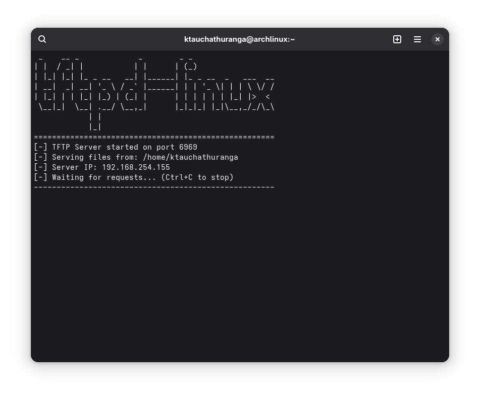

# TFTP Server for Linux (tftpd-linux)

A simple, modern, and secure TFTP (Trivial File Transfer Protocol) server for Linux systems, written in Rust. It is designed to be a lightweight and easy-to-use tool for network booting, firmware updates, and file transfers.



## Features

- **Easy to Use**: Serves files from the directory it is run from. No complex configuration is needed.
- **Concurrent**: Handles multiple client connections simultaneously.
- **Secure**: Prevents directory traversal attacks (`../`), ensuring clients cannot access files outside the serving directory.
- **Read & Write**: Supports both file downloads (Read Requests, RRQ) and uploads (Write Requests, WRQ).
- **Real-time Logging**: Provides clear, real-time progress and status logging for all transfers.
- **Port Flexibility**: Can run on the standard TFTP port (69) with root privileges or a custom unprivileged port (default: 6969).
- **Robust Build System**: Comes with a comprehensive `Makefile` for easy building, installation, and packaging.
- **Manual Page**: Includes a `man` page for quick reference after installation.

## Prerequisites

- **Rust Toolchain**: You must have Rust and Cargo installed. You can install them using [rustup](https://rustup.rs/).
- **Build Tools**: A standard build environment (`make`, `gcc`, etc.) is required.

## How to Build

Clone the repository and use the provided `Makefile` to build the project.

```bash
# Clone the repository
git clone https://github.com/ktauchathuranga/tftpd-linux.git
cd tftpd-linux

# Build the release binary
make build
```

The compiled binary will be available at `target/release/tftpd-linux`.

## How to Install

Installation must be done in two separate steps:

1.  **Build the binary** as a regular user (if you haven't already).
    ```bash
    make build
    ```

2.  **Install the binary and man page** using `sudo`. This will copy the files to `/usr/local/bin` and `/usr/local/share/man`.
    ```bash
    sudo make install
    ```

After installation, the `tftpd-linux` command will be available system-wide.

## How to Use

The server serves files from the **current working directory**.

1.  Navigate to the directory containing the files you want to serve:
    ```bash
    cd /path/to/your/files/
    ```

2.  Run the server.

    -   **To run on the default port (6969):**
        ```bash
        tftpd-linux
        ```

    -   **To run on the standard TFTP port (69), which requires root privileges:**
        ```bash
        sudo tftpd-linux 69
        ```

    -   **To run on a custom port:**
        ```bash
        tftpd-linux 8080
        ```

### Reading the Manual

Once installed, you can view the manual page at any time:
```bash
man tftpd-linux
```

## How to Uninstall

To remove the program and its manual page from your system, run the following command from the project directory:

```bash
sudo make uninstall
```

## For Developers

The `Makefile` includes several other useful targets:

-   `make debug`: Builds the binary in debug mode.
-   `make test`: Runs the automated test suite.
-   `make clean`: Removes all build artifacts.
-   `make package`: Creates a distributable `tar.gz` package in the `dist/` directory.

## Contributing

Contributions are welcome! If you have a suggestion or find a bug, please open an issue or submit a pull request.

## License

This project is licensed under the MIT License. See the [LICENSE](LICENSE) file for details.
